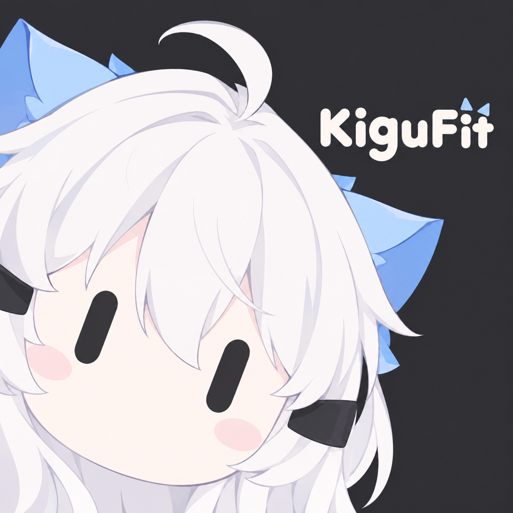
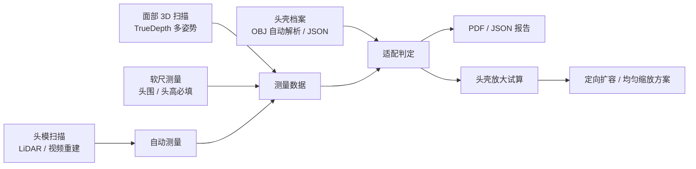
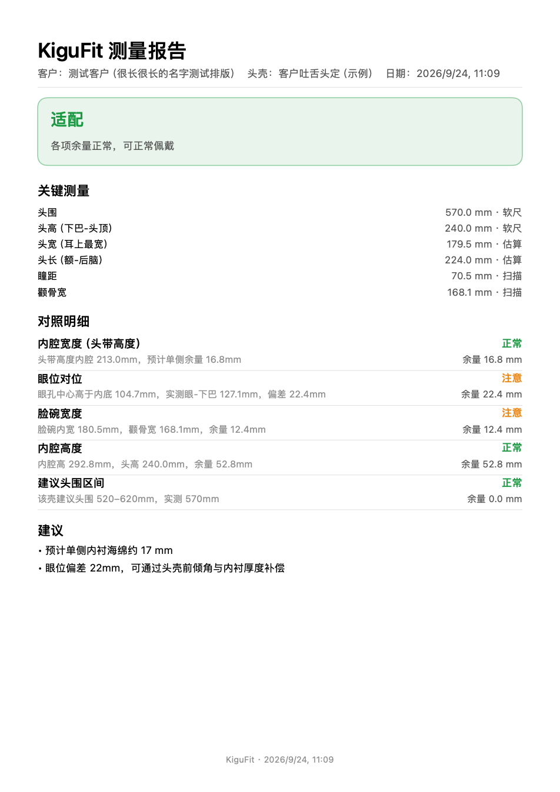
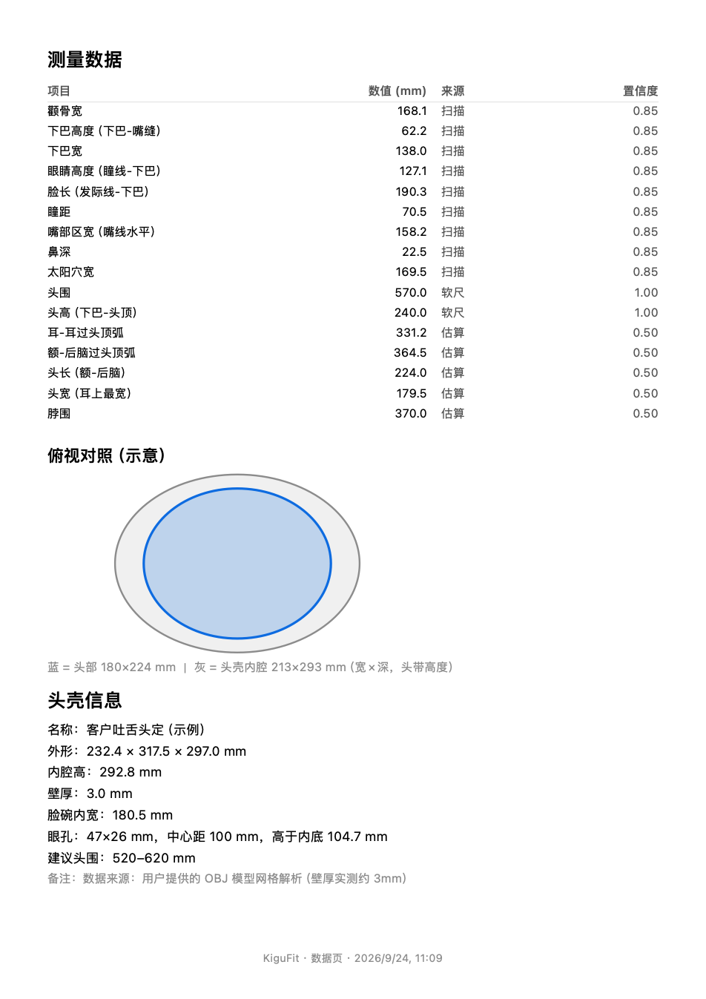
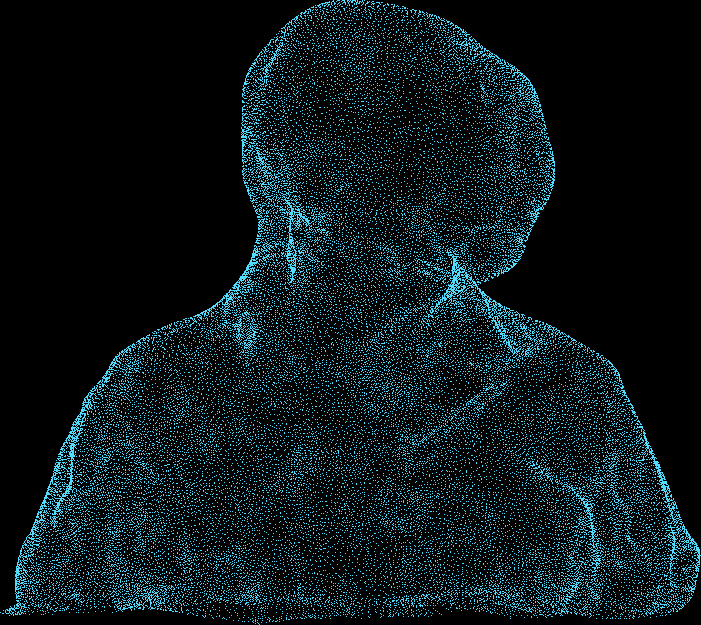

<div align="center">
  
  <h1>KiguFit</h1>
  <p><strong>Kigurumi 头壳测量 · 适配 · 设计工具</strong></p>
  <p>从一次扫描到一份可交付的报告，再到「这个头壳该怎么改」的具体数值</p>
  <p>
    
    
    
    
    
    
  </p>
</div>

---

## 简介

KiguFit 是面向 Kigurumi 头壳制作与佩戴流程的 iOS 原生应用。它把「量头 → 出报告 → 改头壳」整条工作流放进一部手机：

- **佩戴者**：用前置 TrueDepth 做多姿势面部扫描，配合软尺测量，得到与头壳的适配结论
- **头壳店家 / 建模方**：导入 OBJ 头壳模型自动生成尺寸档案，得到内腔余量、海绵配置与放大建议
- **自扫头模**：用后置 LiDAR 绕扫，或直接录一段转圈视频，机内重建出 3D 头模并自动测量

报告为「三方通用」设计：一页结论面向客户，一页数据面向制作方，另附 JSON 供建模直接使用。

## 功能总览

| 模块 | 能力 |
| --- | --- |
| 面部 3D 扫描 | TrueDepth 多姿势引导（正视/左转/右转/抬头/低头），基准校准，准备清单（去眼镜/压发） |
| 软尺测量 | 头围、头高等 7 项，图文化量法说明；缺失项按比例估算并标注置信度 |
| 测量引擎 | 瞳距、太阳穴宽、颧骨宽、下巴宽、眼-下巴、鼻深、脸长等自动测量 |
| 头壳档案 | 内置示例、JSON 导入导出、内腔剖面图、重命名 |
| OBJ 分析引擎 | App 内解析头壳网格：自动判向、内腔宽/深剖面、眼孔检测、壁厚估计 → `kigufit.shell/v1` |
| 适配判定 | 内腔宽度/眼位/脸碗/内高/头围区间五项判定，输出结论、海绵厚度与缩放建议 |
| 头壳放大试算 | 拖动海绵厚度，自动算出各方向缺口、均匀缩放百分比或定向扩容毫米数 |
| 头模扫描 | LiDAR 实时扫描（Object Capture）或照片/视频机内重建（Photogrammetry），导出 USDZ/OBJ |
| 头模自动测量 | 从扫描件自动截取头部区域，输出头宽/头深/估算头围，一键生成测量记录 |
| AI 解读（BYOK） | 自填 API Key（DeepSeek / OpenAI 兼容），对记录与头壳生成中文解读；可选附带降采样几何摘要 |
| 报告导出 | 三方通用 PDF（结论 + 对照 + 俯视示意图 + 数据表）与 `kigufit.scan/v1` JSON |

## 工作流



## 报告示例

以下为应用真实导出的 PDF（由单元测试渲染、非手绘效果图）：

| 第 1 页 · 结论与对照 | 第 2 页 · 数据与俯视示意图 |
| --- | --- |
|  |  |

## 核心实现

### 面部扫描与测量引擎

- 无预览 `ARSession` + `ARFaceTrackingConfiguration`，按姿势角度门控采帧（正视 → 左转 → 右转 → 抬头 → 低头，共约 110 帧）
- 世界坐标系 + 重力方向计算俯仰，双眼连线定义左右基准，**基于「正视起始姿势」做相对角校准**，与设备朝向无关
- 多帧平均后计算 16 项尺寸；缺失的软尺项按人体比例估算并标注来源（扫描 / 软尺 / 估算）与置信度

### OBJ 分析引擎（纯本地，Swift 实现）

- 2 秒内解析 39 万顶点 / 78 万三角面的头壳网格
- 用**眼孔位置**自动判定上下与前后朝向；连通分量识别前脸 / 后壳 / 耳朵
- 逐层提取内腔宽度与深度剖面（相对分数 + 绝对坐标双记录）、栅格洪泛检测眼孔、最近邻估计壁厚
- 与 Mac 端 Python 分析管线交叉验证：带宽 212.7 vs 213.0、眼孔 46×25 vs 47×26、内高 293.5 vs 292.8

### 头模扫描与重建

- **LiDAR 实时扫描**：`ObjectCaptureSession` 引导绕扫，多圈补采，机内 `PhotogrammetrySession` 重建
- **照片 / 视频重建**：支持从相册导入照片或 4K 视频（App 内自动均匀抽帧）→ 机内重建
- 头模自动测量：按颈部收窄 / 肩部特征截取头部区域，自动单位换算（米 → 毫米）

<p align="center">
  
  <br />
  <sub>由一段 4K 转圈视频重建的头模网格（投影示例）</sub>
</p>

### 适配判定与放大试算

- 五项判定逐条给出「头壳值 vs 实测值 vs 余量」与红黄绿状态
- 放大试算以海绵配置（两侧 / 顶部 / 后脑厚度）为输入，输出每个方向的缺口毫米数与均匀缩放百分比，并提示「定向扩容优于均匀缩放」的前脸保护方案

### AI 解读（BYOK）

- 用户在设置中自填 API Key（Keychain 存储），支持 DeepSeek / OpenAI 兼容 / 自定义服务商
- 默认仅发送测量数值与判定结果；可在设置中开启发送**降采样几何摘要**（内腔截面轮廓 / 面部点云采样）
- 解读写入记录并同步渲染进 PDF

## 数据格式

所有档案与导出均为可读 JSON，便于跨工具流转。

### `kigufit.shell/v1`（头壳档案，节选）

```json
{
  "schema": "kigufit.shell/v1",
  "name": "客户吐舌头定",
  "outer": { "width": 232.4, "depth": 317.5, "height": 297.0 },
  "inner": {
    "height": 292.8,
    "wallThickness": 3.0,
    "widthProfile": [{ "z": -21, "width": 223.2, "fraction": 0.36 }],
    "faceBowlWidth": 180.5
  },
  "eyeHoles": { "width": 47, "height": 26, "centerSpacing": 100, "centerAboveInnerBottom": 104.7 }
}
```

### `kigufit.scan/v1`（测量记录导出，节选）

```json
{
  "schema": "kigufit.scan/v1",
  "client": "客户代号",
  "measurements": [
    { "key": "headCircumference", "label": "头围", "value": 570, "unit": "mm", "source": "tape", "confidence": 1.0 }
  ],
  "verdict": { "level": "good", "summary": "各项余量正常，可正常佩戴" }
}
```

## 技术栈

| 方向 | 选型 |
| --- | --- |
| UI | SwiftUI（iOS 17+，仅竖屏，自研动效系统） |
| 面部扫描 | ARKit `ARFaceTrackingConfiguration`（TrueDepth） |
| 头模扫描 | RealityKit `ObjectCaptureSession` + `PhotogrammetrySession`（机内重建） |
| 持久化 | SwiftData（+ externalStorage 保存网格） |
| 密钥安全 | Keychain（BYOK API Key） |
| 报告渲染 | UIKit `UIGraphicsPDFRenderer` |
| 网格转换 | ModelIO（USDZ → OBJ） |
| 测试 | Swift Testing（18 项单元测试，含 PDF 渲染回归） |

## 快速开始

### 环境要求

- macOS + Xcode（支持 iOS 17+ SDK）
- iPhone 机型要求：
  - 面部扫描：带 Face ID 的机型（TrueDepth）
  - LiDAR 实时头模扫描：带 LiDAR 的 Pro 机型
  - 照片 / 视频重建与其余功能：iOS 17+ 均可

### 构建

```bash
# 模拟器构建（可验证全部非 ARKit 逻辑）
xcodebuild -project KiguFit.xcodeproj -scheme KiguFit \
  -sdk iphonesimulator -destination 'generic/platform=iOS Simulator' build
```

### 运行到真机（自签）

1. Xcode 打开 `KiguFit.xcodeproj`，Signing & Capabilities 里选择你的 Personal Team
2. 连接 iPhone，⌘R 安装；免费账号证书 7 天有效（可用 AltStore / SideStore 自动续签）
3. 首次启动会请求相机权限；建议把手机举到与眼同高再开始扫描

### 测试

```bash
xcodebuild test -project KiguFit.xcodeproj -scheme KiguFit \
  -destination 'platform=iOS Simulator,name=iPhone 17 Pro'
```

## 项目结构

```
KiguFit/
├─ Analysis/      OBJ 解析、头壳分析引擎、头模自动测量
├─ AI/            BYOK 设置、Keychain、OpenAI 兼容客户端、提示词流水线
├─ Design/        动效系统（弹簧常量 / 错峰入场 / 数字滚动）
├─ Fit/           适配规则引擎、放大试算
├─ HeadScan/      LiDAR 扫描、照片/视频重建、帧抽取
├─ Measurement/   测量计算与估算
├─ Models/        SwiftData 模型与 JSON Schema
├─ Report/        PDF 渲染、导出服务
├─ Scan/          面部扫描会话、姿势校准、网格编解码
└─ Views/         全部页面
```

开发约定与路线图见 [AGENTS.md](AGENTS.md)。

## 隐私

- 扫描与网格数据默认**全部留在本机**；AI 解读仅在用户开启并配置 Key 后发送
- 默认只发送测量数值与判定结果；几何摘要（轮廓 / 点云采样）需在设置中显式开启
- API Key 保存在系统钥匙串，不经过任何第三方服务器

## 路线图

| 阶段 | 内容 | 状态 |
| --- | --- | --- |
| P1 | 面部扫描 + 软尺 + 记录 + PDF/JSON 报告 | 已完成 |
| P2 | 头壳档案管理、OBJ 导入、剖面可视化、放大试算 | 已完成 |
| P3 | 本地 OBJ 分析引擎、BYOK LLM 流水线、头模自动测量 | 已完成 |
| P4 | 多步对话 Agent、跨记录分析 | 计划中 |

---

<div align="center">
  <sub>KiguFit · 为每一顶头壳找到合适的主人</sub>
</div>
